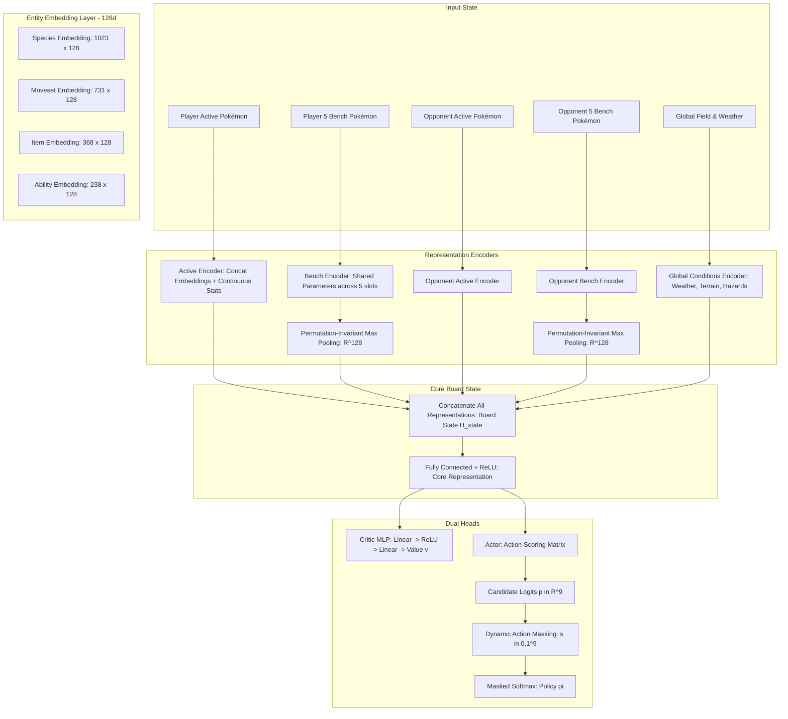

# CONTEXT.md — Deep Domain Context, Game Theory & Theoretical Foundations (v2)

This document provides the exhaustive theoretical foundation, game-theoretic formulation, architectural specification, and engineering post-mortem for **Amnesia-AI v2**.

---

## 1. Post-Mortem: Comprehensive Failure Analysis of v1

Before building v2, a thorough diagnostic was conducted on v1 to identify why it stagnated and failed against human players:

### 1.1 The "Toy Simulator" Trap (The Reality Gap)
* **What v1 did**: Implemented a handcrafted fast simulator (`Gen8FastSimEnvironment` / `mechanics.py`) in Python, simplifying battle mechanics to hit ~250 turns/second on CUDA.
* **The Fatal Flaw**: Competitive Pokémon features hundreds of interacting mechanics that cannot be approximated without introducing severe distribution shift:
  * *Abilities*: Missed multi-turn and trigger-based abilities like *Magic Bounce* (reflects hazards/status), *Regenerator* (heals 33% on switch), *Intimidate* (cuts attack on entry), *Levitate* (ground immunity), and *Unseen Fist*.
  * *Items*: Ignored locking mechanics of *Choice Specs/Band/Scarf*, healing of *Leftovers/Black Sludge*, and damage reduction of *Assault Vest*.
  * *Turn Priority & Simultaneous Execution*: Switches occur at priority +6, while moves execute based on dynamic speed brackets, weather modifiers, and paralysis penalties.
* **The Consequence**: The agent overfit to an artificial, toy world. When placed on the real Pokémon Showdown server, actions that were "optimal" in the toy simulator resulted in immediate blunders.

### 1.2 The "Flat Vector" Bottleneck (Semantic Blindness)
* **What v1 did**: Compressed the entire 12-Pokémon battle state into a tiny flat vector of **76 numerical floats**.
* **The Fatal Flaw**: Categorical entities in Pokémon cannot be represented as continuous scalars:
  * Mapping Pokémon species to arbitrary numbers or normalized stats strips away their identity, movepools, and typing threats.
  * The network could not differentiate between switching into a physical wall (*Ferrothorn*) versus a frail glass cannon (*Weavile*); both appeared as similar HP and stat ratios.
  * Moves with identical base power (e.g. *Earthquake* vs *High Horsepower*) or status moves (e.g. *Toxic* vs *Thunder Wave* vs *Recover*) were collapsed into uninformative utility floats.
* **The Consequence**: The neural network was representationally blind to the strategic reality of the game.

### 1.3 The "Myopic Reward" Trap (Reward Misalignment)
* **What v1 did**: Used dense, turn-level damage rewards:
  $$R_t = 1.5 \cdot \text{DamageDealt} - 1.0 \cdot \text{DamageTaken} + 3.0 \cdot \text{KO}$$
* **The Fatal Flaw**: In competitive Pokémon, many of the highest-value plays deal **zero damage**:
  * Setting entry hazards (*Stealth Rock*, *Spikes*) on turn 1 pays dividends across 30 turns.
  * Defensive pivoting (*U-turn*, *Teleport*, *Volt Switch*) concedes immediate damage to gain positioning.
  * Stat setup moves (*Dragon Dance*, *Calm Mind*, *Nasty Plot*) sacrifice turn momentum for an endgame sweep.
  * Sacrificing a low-health Pokémon (*Fodder*) preserves momentum without taking damage on a healthy sweeper.
* **The Consequence**: The agent degenerated into a greedy bot that merely chased immediate damage each turn. It played exactly like a noisy `MaxDamage` heuristic.

### 1.4 Architectural Sprawl & Monorepo Dilution
* **What v1 did**: Spread effort across 10 disjointed subprojects: Bun/TypeScript simulators, Selenium web crawlers, replay scrapers, team builders, matchup calculators, and type classifiers.
* **The Fatal Flaw**: Cognitive bandwidth and computational resources were squandered on peripheral tooling rather than perfecting the core policy and environment.

### 1.5 Comparison Matrix: Amnesia-AI v1 vs v2

| Dimension | Amnesia-AI v1 (Failed) | Amnesia-AI v2 (Huang & Lee 2019) |
|---|---|---|
| **Battle Engine** | Handcrafted fast Python simulator (approximated) | Official Pokémon Showdown via `poke-env` (authentic) |
| **State Encoding** | Flat vector of 76 floats | Multi-level tree with **128-d Entity Embeddings** |
| **Model Size** | ~72,000 parameters | **1,327,618 parameters** |
| **Categorical Vocab** | None (stats only) | 1,023 Species, 731 Moves, 368 Items, 238 Abilities |
| **Reward Function** | Dense damage heuristic ($\pm 1.5$ dmg, $+3$ KO) | Terminal Zero-Sum ($\pm 1.0$ win/loss) + tiny auxiliary ($\pm 0.01$) |
| **Credit Assignment** | Isolated turn-level TD error | Full-trajectory backward GAE ($\gamma=0.99, \lambda=0.95$) |
| **Opponent Regimes** | Mixed heuristics (Random, MaxDamage, League) | **Pure Symmetric Self-Play** ($f_\theta$ vs $f_\theta$) |
| **Target Format** | Gen 8 OU (6v6 with team-matchup bias) | **`gen7randombattle` / `gen8randombattle`** (level-balanced) |
| **Action Masking** | Heuristic post-processing | Exact renormalized binary masking $s \in \{0, 1\}^9$ |
| **Codebase Scope** | 10 subprojects, 2 runtimes (Python + Bun) | **1 clean Python package (`src/`)** |

---

## 2. Game-Theoretic Foundations of Competitive Pokémon

### 2.1 The POMDP Formalism
Competitive Pokémon is a two-player, zero-sum, imperfect-information extensive-form game with simultaneous moves and stochastic transitions. We formalize it as a Partially Observable Markov Decision Process (POMDP):
$$\mathcal{M} = \langle \mathcal{S}, \mathcal{A}, \mathcal{T}, \mathcal{R}, \Omega, \mathcal{O}, \gamma \rangle$$

* **State Space $\mathcal{S}$**: The true underlying game state, including hidden information:
  * Unrevealed opponent movesets (up to 4 moves per Pokémon).
  * Unrevealed items, abilities, and exact EV/IV stat spreads.
  * Hidden pseudo-random number generator (PRNG) seeds governing damage rolls ($[0.85, 1.00]$), critical hits ($4.17\%$), move accuracy checks, and secondary effect chances.
* **Observation Space $\Omega$**: The information set visible to player $i$:
  * Active Pokémon species, visible HP percentages, revealed moves, known abilities/items, field conditions (weather, terrain, hazards, screens), and turn counter.
* **Action Space $\mathcal{A}$**: A discrete action space of cardinality $n = 9$:
  * Actions $0, 1, 2, 3$: Execute Move 1, 2, 3, or 4 on the active Pokémon.
  * Actions $4, 5, 6, 7, 8$: Switch to Bench Pokémon 1, 2, 3, 4, or 5.
* **Transition Function $\mathcal{T}(s' \mid s, a_1, a_2)$**: Governed strictly by the official Pokémon Showdown battle engine. Resolves simultaneous actions via priority brackets, speed comparisons, and mechanics rules.
* **Reward Function $\mathcal{R}$**:
  $$R_{\text{terminal}} = \begin{cases} +1.0 & \text{if Player 1 wins} \\ -1.0 & \text{if Player 1 loses} \end{cases}$$
  Auxiliary shaping rewards (scaled down by orders of magnitude to avoid subverting the terminal objective):
  $$r_{\text{faint}} = -0.0125 \quad (\text{own Pokémon faints}), \quad r_{\text{supereffective}} = +0.0025 \quad (\text{super-effective move hits})$$

### 2.2 Simultaneous Moves & Nash Equilibrium
Unlike Chess or Go, Pokémon turns resolve **simultaneously**:
1. At turn $t$, Player 1 chooses action $a_1 \in \mathcal{A}_1$ and Player 2 chooses action $a_2 \in \mathcal{A}_2$ without observing the other's choice.
2. The turn resolution can be viewed as a local matrix game where payoffs depend on the joint action $(a_1, a_2)$.
3. Pure minimax tree search fails in simultaneous games because deterministic policies are trivially exploitable (e.g. predicting a switch and using a coverage move; predicting the prediction and attacking directly).
4. The optimal policy is a **Mixed Strategy Nash Equilibrium** $\pi^*$, where actions are chosen probabilistically from a distribution. Policy-gradient RL with entropy regularization naturally converges toward mixed strategies, preventing the agent from becoming predictable.

### 2.3 Why Random Battles? (The Level-Balancing Theorem)
In standard constructed tiers (like Gen 8 OU):
* Pre-built teams suffer from **Matchup Fishing**: Certain team archetypes (e.g. Rain Offense vs Sun Offense) have 70-30 win-rate skews decided before turn 1.
* In a dataset or self-play pool of few teams, the agent overfits to specific Pokémon combinations rather than learning general tactical battle principles.

In **`gen7randombattle` / `gen8randombattle`**:
* **Level Balancing**: Pokémon in lower tiers have higher levels (e.g. Rayquaza at Level 74 vs Butterfree at Level 88), equalizing base stat totals.
* **Maximal Coverage**: Teams are sampled procedurally from hundreds of species and thousands of movesets, forcing the agent to learn universal concepts of typing, stat stages, pivoting, and tempo.
* **Ground Truth Benchmark**: As demonstrated by Huang & Lee (2019), an agent trained on Random Battles achieves generalist tactical competence and reaches a 1677 rating on Showdown.

---

## 3. The 1.3-Million Parameter Embedding Architecture (Figure 1 Deep Dive)

The neural network $f_\theta$ takes the hierarchical POMDP observation state and outputs both a policy distribution $\pi \in \mathbb{R}^9$ and a scalar value estimate $v \in [-1.0, +1.0]$.



### 3.1 Feature Inventory & Dimensionality (Table I from paper)

Every Pokémon in the observation tree is decomposed into categorical tokens and continuous vectors:

| Feature Name | Type | Cardinality / Dims | Description |
|---|---|---|---|
| `species` | Categorical | $1 \times 1023$ | Primary identity of the Pokémon |
| `item` | Categorical | $1 \times 368$ | Held item (or `<UNKNOWN>` / `<NONE>`) |
| `ability` | Categorical | $1 \times 238$ | Active ability (or `<UNKNOWN>`) |
| `moveset` | Categorical | $4 \times 731$ | Known moves in slots 1–4 |
| `lastmove` | Categorical | $1 \times 731$ | Most recent move executed |
| `stats` | Continuous | 6 | Normalized base stats: HP, Atk, Def, SpA, SpD, Spe |
| `boosts` | Continuous | 6 | Stat stage modifiers from $-6$ to $+6$ (normalized to $[-1, +1]$) |
| `hp` / `maxhp` | Continuous | 2 | Current hit points and maximum hit points |
| `pp_used` | Continuous | 4 | Number of PP consumed per move slot |
| `is_active` | Indicator | 1 | $1$ if currently active in battle, else $0$ |
| `is_fainted` | Indicator | 1 | $1$ if HP is $0$, else $0$ |
| `status` | Indicator | 28 | One-hot/multi-hot vector: Sleep, Toxic, Burn, Paralysis, Freeze, etc. |
| `types` | Indicator | 18 | Multi-hot vector for elemental typing (e.g. Water/Ground) |
| `volatiles` | Indicator | 23 | Active volatile status flags: Leech Seed, Taunt, Substitute, Confusion, etc. |

### 3.2 Permutation-Invariant Team Pooling
In Pokémon, the order of Pokémon on the bench has **zero strategic meaning**: a bench with `[Ferrothorn, Heatran]` is identical to `[Heatran, Ferrothorn]`.  
To prevent the neural network from wasting capacity learning bench-order permutations:
1. Each of the 5 bench Pokémon is processed through the **same shared encoder MLP**:
   $$h_j = \text{Encoder}_{\text{bench}}(\text{mon}_j) \in \mathbb{R}^{d_{\text{embed}}}$$
2. The bench representations are combined using **element-wise Max Pooling**:
   $$h_{\text{bench}} = \max_{j=1}^5 (h_j) \in \mathbb{R}^{d_{\text{embed}}}$$
This guarantees mathematical permutation invariance over bench permutations.

### 3.3 Dynamic Invalid Action Masking
To prevent the agent from sampling illegal actions (such as switching into a fainted Pokémon, or executing a move with 0 PP):
1. The environment constructs an exact binary mask $s \in \{0, 1\}^9$.
2. The network outputs raw unconstrained action logits $p \in \mathbb{R}^9$.
3. Illegal logits are masked to $-\infty$ (or a large negative constant $-10^8$) before the softmax:
   $$\tilde{p}_i = \begin{cases} p_i & \text{if } s_i = 1 \\ -\infty & \text{if } s_i = 0 \end{cases}$$
4. The action distribution is computed via softmax:
   $$\pi_i = \frac{\exp(\tilde{p}_i)}{\sum_{j=1}^9 \exp(\tilde{p}_j)}$$
This guarantees that $\pi_i = 0$ for all illegal choices $s_i = 0$, ensuring **100% legal action execution** during both exploration and inference.

---

## 4. Pure Symmetric Self-Play & GAE-PPO Optimization

### 4.1 The Self-Play Training Loop (Algorithm 1)

```text
Algorithm: Pure Self-Play Policy Optimization (Huang & Lee 2019)
================================================================
Input: Initial parameters θ_0, matches per iteration m = 7680, discount γ = 0.99, GAE λ = 0.95
For iteration i = 0, 1, 2, ... do:
    1. Initialize empty trajectory buffer D = []
    2. Concurrently simulate m self-play matches using f_{θ_i} as BOTH Player 1 and Player 2.
    3. For each match, collect trajectories from BOTH perspectives:
       - Trajectory τ_1: (s_t^1, a_t^1, r_t^1, s_{t+1}^1, mask_t^1)
       - Trajectory τ_2: (s_t^2, a_t^2, r_t^2, s_{t+1}^2, mask_t^2)
       Append all 2m trajectories to buffer D.
    4. For each trajectory in D:
       Compute temporal difference residuals:
           δ_t = r_t + γ V_{θ_i}(s_{t+1}) - V_{θ_i}(s_t)
       Compute Generalized Advantage Estimates:
           A_t = Σ_{l=0}^∞ (γ λ)^l δ_{t+l}
       Compute target returns:
           R_t = A_t + V_{θ_i}(s_t)
    5. Optimize network parameters θ via PPO across 4 epochs on buffer D:
           θ_{i+1} = PPO_Update(θ_i, D, advantages=A, returns=R)
    6. Periodically evaluate f_{θ_{i+1}} against fixed baseline bots and save checkpoint.
End
```

### 4.2 Full Trajectory Credit Assignment
Because a single battle may last 20 to 50 turns, credit assignment must link early decisions (e.g. setting *Stealth Rock* on turn 2) to final victory ($+1.0$ at turn 35).  
Unlike v1's turn-by-turn TD formulation, GAE backward recursion discounts across the **entire chronological sequence**:
$$\hat{A}_t = \delta_t + (\gamma \lambda) \hat{A}_{t+1} \cdot (1 - d_t)$$
where $d_t = 1$ if the battle terminated at turn $t$. This allows the $+1.0$ terminal victory reward to propagate back through all 35 turns, rewarding the strategic setup that enabled the win.

---

## 5. Technology Stack & Component Architecture

```text
src/
├── __init__.py       # Package definition & exports
├── model.py          # PyTorch Actor-Critic Net with 128-d Entity Embeddings & Action Masking
├── env.py            # poke-env wrapper extracting Table I features into PyTorch tensors
├── train.py          # Pure Self-Play PPO training loop (Algorithm 1)
├── evaluate.py       # Multi-opponent evaluation suite (Random, MaxBasePower, SimpleHeuristics)
└── client.py         # Live Pokémon Showdown WebSocket ladder client with replay recorder
```

* **`poke-env`**: Provides official WebSocket interfacing with Pokémon Showdown, automated parsing of protocol messages, and standard Gymnasium API compliance.
* **PyTorch 2.6+ with CUDA & TF32**: Executes accelerated tensor operations on Ampere+ GPUs with `torch.backends.cuda.matmul.allow_tf32 = True`.
