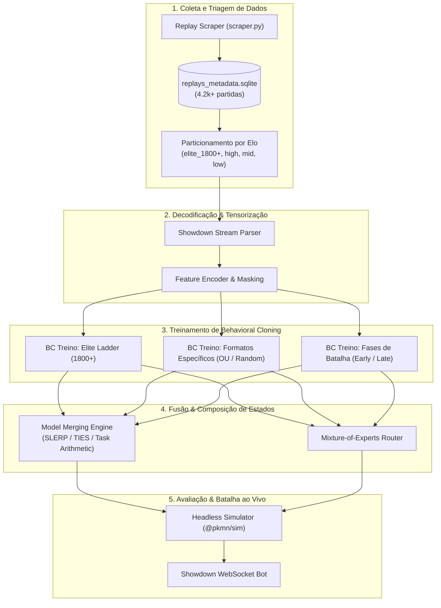

# Amnesia-AI Documentation

Bem-vindo à documentação técnica e arquitetural do **Amnesia-AI**, um ecossistema de inteligência artificial autônoma para Pokémon Showdown competitivo de alto nível.

---

## 📚 Índice da Documentação

### 1. [Pipeline de Behavioral Cloning (BC)](file:///c:/Users/caihe/Documents/develop/Amnesia-AI/docs/behavioral_cloning.md)
Guia aprofundado sobre imitação de especialistas (expert imitation learning):
- Formulação matemática do BC e ponderação amostral por Elo ($w$).
- Filtragem de ruído, forfeits e alucinações táticas de jogadores casuais.
- Arquiteturas de rede (Policy Network $\pi_\theta(a|s)$ e Value Network $V_\phi(s)$).
- Formulação de perda (Cross-Entropy ponderada + Regularização de Entropia).
- Algoritmos offline avançados: DAgger, Offline RL / IQL (Implicit Q-Learning), Decision Transformer e CQL.

### 2. [Fusão e Composição de Modelos (Model Merging & Checkpoints)](file:///c:/Users/caihe/Documents/develop/Amnesia-AI/docs/model_merging.md)
Guia de engenharia para combinar diferentes estados de treino, formatos e fases de jogo:
- Técnicas de fusão de pesos no espaço de parâmetros:
  - **Weight Averaging / Polyak Averaging**
  - **SLERP (Spherical Linear Interpolation)**
  - **Task Arithmetic / Model Soups**
  - **TIES-Merging & DARE**
- Ensembles em tempo de inferência (Mixture of Experts - MoE).
- Fusão de estados heterogêneos: especialistas por fase de jogo (Early / Mid / Late Game) e especialistas por formato (`gen9randombattle` vs `gen9ou`).
- Versionamento estruturado de checkpoints e metadados (`model_registry.json`).

### 3. [Arquitetura de Estados e Representação (State Representation & Embeddings)](file:///c:/Users/caihe/Documents/develop/Amnesia-AI/docs/state_representation.md)
Especificação completa de como um replay ou batalha ao vivo é convertido em tensores:
- Vetorização do Pokémon ativo e banco de reservas.
- Condições de campo, clima, terrenos, hazards e contadores de turnos.
- Matriz de crença estocástica (*Belief Distribution*) sobre informações ocultas.
- Normalização de ações e validação de legalidade (`masking`).

### 4. [Protocolo e Integração de Batalha (Showdown Protocol & Replays)](file:///c:/Users/caihe/Documents/develop/Amnesia-AI/docs/battle_protocol.md)
Documentação técnica do parser de streams e ciclo de vida:
- Protocolo WebSocket do Pokémon Showdown.
- Parsing determinístico de logs (`|request|`, `|move|`, `|switch|`, `|-damage|`, `|win|`).
- Pipeline de replay scraping e indexação SQLite de alta performance.

---

## 🗺️ Mapa Geral do Sistema Amnesia-AI

---

## 🚀 Navegação Rápida

- Para entender o treinamento inicial supervisionado a partir dos replays coletados, leia o [Guia de Behavioral Cloning](file:///c:/Users/caihe/Documents/develop/Amnesia-AI/docs/behavioral_cloning.md).
- Para combinar checkpoints de diferentes treinadores, epochs ou formatos, consulte o [Guia de Model Merging](file:///c:/Users/caihe/Documents/develop/Amnesia-AI/docs/model_merging.md).
- Para entender o formato exato dos tensores de entrada da rede neural, consulte a [Arquitetura de Estados](file:///c:/Users/caihe/Documents/develop/Amnesia-AI/docs/state_representation.md).
