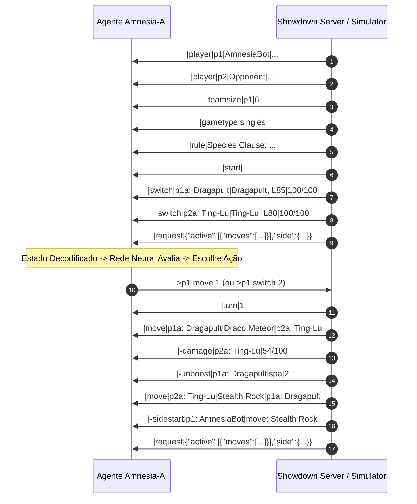

# Protocolo Pokémon Showdown & Processamento de Replays

Este documento descreve o fluxo de comunicação via streams do Pokémon Showdown, a decodificação de logs e o pipeline de mineração e indexação de dados para aprendizado de máquina.

---

## 1. Ciclo de Vida da Batalha no Protocolo Showdown

A comunicação com servidores Showdown e simuladores `@pkmn/sim` ocorre em mensagens delimitadas por quebras de linha (`\n`) com pipes (`|`) separando os parâmetros.

---

## 2. Dicionário de Diretivas de Protocolo Críticas

| Diretiva | Descrição e Estrutura | Impacto no Estado Interno |
|---|---|---|
| `\|request\|<json>` | Payload enviado exclusivamente ao jogador para solicitar uma ação. Contém os golpes legais, PP restante e opções de troca. | Define as ações legais e constrói a máscara booleana (`Action Mask`). |
| `\|move\|<src>\|<move>\|<target>` | Notifica que uma ação de golpe foi executada. | Revela golpe no banco de dados do oponente; consome 1 PP. |
| `\|switch\|<slot>\|
\|<hp>` | Um Pokémon entrou em campo. Contém espécie, nível, gênero e HP/status. | Atualiza o Pokémon ativo na mesa; reseta boosts temporários do Pokémon anterior. |
| `\|drag\|<slot>\|
\|<hp>` | Entrada forçada em campo (ex: após *Roar*, *Whirlwind* ou *Red Card*). | Similar ao switch, mas sem decisão voluntária de turno. |
| `\|-damage\|<slot>\|<hp_ratio>` | Redução de vida de um Pokémon. | Atualiza o escalar contínuo de HP relativo. |
| `\|-heal\|<slot>\|<hp_ratio>` | Recuperação de vida. | Atualiza o escalar contínuo de HP relativo. |
| `\|-boost\|<slot>\|<stat>\|<amt>` | Incremento de estatística de combate (+1 a +6). | Modifica o vetor de boosts daquele Pokémon ativo. |
| `\|-unboost\|<slot>\|<stat>\|<amt>` | Redução de estatística de combate (-1 a -6). | Modifica o vetor de boosts daquele Pokémon ativo. |
| `\|-weather\|<weather>` | Mudança de clima (Sun, Rain, Sandstorm, Snow). | Atualiza a variável global de clima e o contador de turnos de clima. |
| `\|-fieldstart\|<terrain>` | Início de terreno (Electric, Grassy, Psychic, Misty). | Atualiza a variável global de terreno e o contador de turnos. |
| `\|-sidestart\|<side>\|<hazard>` | Hazard colocado (Stealth Rock, Spikes, Sticky Web). | Incrementa contadores de hazard do lado afetado. |
| `\|-sideend\|<side>\|<hazard>` | Hazard removido (via *Rapid Spin*, *Defog*, *Mortal Spin*). | Zera ou decrementa os hazards daquele jogador. |
| `\|faint\|<slot>` | Pokémon nocauteado. | Marca o Pokémon como morto (`is_alive = 0`, `hp = 0`). Se for o Pokémon ativo, força tela de substituição. |
| `\|win\|<player>` | Fim de batalha; declara o vencedor. | Conclui a trajetória; distribui recompensa terminal ($+1$ para vencedor, $-1$ para perdedor). |

---

## 3. Arquitetura do Replay Scraper & Indexador SQLite

O projeto conta com o módulo `projects/replay-scraper/` para harvester em larga escala de dados competitivos:

### 3.1 Pipeline de Extração:
1. **Replay Query API**: Consulta `https://replay.pokemonshowdown.com/search.json?format=<format>&page=<page>`.
2. **Filtro de Rating**: Ignora partidas com jogadores abaixo de determinado threshold de pontuação.
3. **Download Assíncrono com Rate-Limiting**: Coleta o log textual bruto `https://replay.pokemonshowdown.com/<id>.log`.
4. **Armazenamento e Metadados**:
   - Salva o arquivo `.log` categorizado por pasta de bracket de Elo (`elite_1800plus/`, `high_1650_1799/`, etc.).
   - Grava no banco `data/replays/replays_metadata.sqlite` garantindo chave primária única (`id`) e cálculo instantâneo do peso de treino ($w$).
