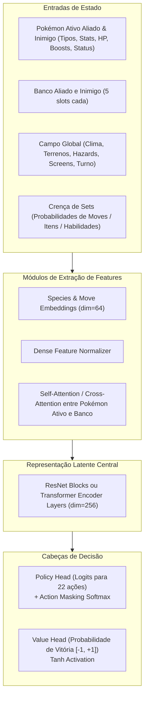

# Behavioral Cloning (BC) & Algoritmos de Imitação

Este documento detalha os fundamentos teóricos, equacionamento matemático, arquitetura de redes e pipeline prático de **Behavioral Cloning (BC)** e **Offline Imitation Learning** aplicados ao Pokémon Showdown no Amnesia-AI.

---

## 1. Visão Geral e Motivação

O Pokémon competitivo possui um espaço de estados e ações combinatório gigantesco ($>10^{358}$ ramificações de estados). Iniciar o aprendizado puramente por **Reinforcement Learning tabular ou por tentativa e erro aleatório (Tabula Rasa RL)** sofre com o problema de esparsidade de recompensa: um agente aleatório pode demorar milhões de passos para sequer aprender a usar golpes super efetivos ou trocar antes de sofrer um nocaute evitável.

O **Behavioral Cloning (BC)** contorna esse obstáculo utilizando um vasto conjunto de demonstrações de jogadores experientes obtidas através dos replays do Pokémon Showdown. O BC funciona como o passo de **warm-up supervisionado**, ensinando à rede neural a distribuição básica de prioridades, coberturas de tipo e trocas defensivas antes do auto-confronto (Self-Play RL).

---

## 2. Formulação Matemática do BC

Dado um dataset de demonstrações $\mathcal{D} = \{(s_t, a_t, w_t)\}_{t=1}^N$, onde:
- $s_t \in \mathcal{S}$ é o estado observado da batalha no turno $t$.
- $a_t \in \mathcal{A}$ é a ação executada pelo jogador vencedor ($a_t \in \{\text{Move}_1, \dots, \text{Move}_4, \text{Switch}_1, \dots, \text{Switch}_5, \text{Tera/Gimmick}\}$).
- $w_t \in \mathbb{R}^+$ é o peso da amostra baseado na qualidade do jogador (Elo) e na consistência da partida.

O objetivo do Behavioral Cloning padrão é maximizar a log-verossimilhança das ações dos especialistas, minimizando a perda de entropia cruzada ponderada:

$$\mathcal{L}_{BC}(\theta) = - \frac{1}{\sum_{i=1}^B w_i} \sum_{i=1}^B w_i \log \pi_\theta(a_i \mid s_i)$$

Onde:
- $\pi_\theta(a \mid s)$ é a probabilidade atribuída pela política parametrizada pelos pesos $\theta$.
- $B$ é o tamanho do mini-batch.

### 2.1 Ponderação Amostral por Nível de Habilidade (Elo Weighting)

Nem todas as demonstrações em Showdown têm a mesma qualidade técnica. Um jogador de Elo $2400+$ possui um valor de decisão infinitamente superior a um jogador casual de Elo $1100$.

No pipeline do Amnesia-AI, cada amostra possui um peso de importância $w$ computado da seguinte forma:

$$w = \text{clip}\left(1.0 + \frac{\text{Elo} - 1600}{400}, 0.1, 2.0\right) \times \gamma_{\text{forfeit}}$$

Onde:
- $\gamma_{\text{forfeit}} = 0.5$ se a partida terminou por desistência em menos de 4 turnos (ruído tático / tilt), ou $1.0$ caso contrário.
- Amostras de jogadores $\ge 2000$ Elo recebem peso próximo de $2.0$.
- Amostras de jogadores casuais recebem peso reduzido até $0.1$.

### 2.2 Regularização de Entropia e Action Masking

Em Pokémon, diversas ações em um turno são estritamente **ilegais** (ex.: trocar para um Pokémon fainted, usar um golpe sem PP, trocar quando preso por *Shadow Tag* ou *Mean Look*).

A probabilidade da política é calculada aplicando **Action Masking** no vetor de logits $z(s) \in \mathbb{R}^{|\mathcal{A}|}$:

$$\tilde{z}_j(s) = \begin{cases} z_j(s) & \text{se ação } j \text{ for válida no estado } s \\ -\infty & \text{se ação } j \text{ for inválida} \end{cases}$$

$$\pi_\theta(a_j \mid s) = \frac{\exp(\tilde{z}_j(s))}{\sum_{k \in \mathcal{A}_{\text{legal}}(s)} \exp(\tilde{z}_k(s))}$$

Para evitar o colapso prematuro da política em apenas um golpe previsível, adicionamos um termo de regularização de entropia à função de custo:

$$\mathcal{L}_{\text{total}}(\theta) = \mathcal{L}_{BC}(\theta) - \beta \mathcal{H}(\pi_\theta(\cdot \mid s))$$

Onde $\mathcal{H}(\pi) = -\sum_a \pi(a \mid s) \log \pi(a \mid s)$ e $\beta \approx 0.01$.

---

## 3. O Problema do Erro Composto (Distributional Shift)

O maior limitador do Behavioral Cloning puro é o fenômeno conhecido como **Covariate Shift / Compounding Errors** (Ross & Bagnell, 2011).

```
   Trajetória do Especialista:  s0 ──> s1 ──> s2 ──> s3 ──> Vitória
                                 \
   Pequeno erro do agente BC:     s1' ──> s2' ──> s3' (Estado nunca visto!)
                                           \
                                            Colapso tático / derrota
```

Quando o agente toma uma decisão ligeiramente diferente do especialista, ele entra em um estado $s'$ que não existia nos replays de treino de alta pontuação. Como a rede nunca viu $s'$, a política alucina e comete erros catastróficos subsequentes.

---

## 4. Algoritmos Avançados de Imitação para Amnesia-AI

Para superar o erro composto do BC clássico, o ecossistema Amnesia-AI implementa 4 algoritmos complementares:

### 4.1 DAgger (Dataset Aggregation)

O **DAgger** resolve o Distributional Shift consultando o especialista durante o roll-out do próprio agente:
1. Treina a política inicial $\pi_{\theta_0}$ com BC nos replays.
2. Executa a política $\pi_{\theta_t}$ no simulador (`projects/simulator`), gerando novos estados visitados pelo robô.
3. Consulta um oráculo/especialista (ex.: motor Heurístico avançado ou Minimax) para etiquetar qual seria a ação correta em cada estado visitado pelo robô.
4. Concatena os novos pares $(s, a^*)$ ao dataset $\mathcal{D} \leftarrow \mathcal{D} \cup \mathcal{D}_{\text{novo}}$ e retreina a política.

### 4.2 IQL (Implicit Q-Learning) e CQL (Conservative Q-Learning)

Técnicas de **Offline Reinforcement Learning** que aprendem tanto a política $\pi_\theta(a|s)$ quanto uma função de valor $Q_\phi(s, a)$ a partir dos replays, sem sofrer com superestimação de ações fora da distribuição (Out-of-Distribution - OOD):
- **Conservative Q-Learning (CQL)**: Penaliza os Q-values de ações não presentes nos replays, garantindo que o agente só prefira escolhas com evidência estatística sólida.
- **Implicit Q-Learning (IQL)**: Evita consultar a função $Q$ fora da base de dados usando regressão quantílica para estimar $V(s)$ e extrai a política com *Advantage Weighted Regression (AWR)*:
  $$\max_\theta \mathbb{E}_{(s, a) \sim \mathcal{D}} \left[ \exp\left(\frac{Q(s, a) - V(s)}{\tau}\right) \log \pi_\theta(a \mid s) \right]$$

### 4.3 Decision Transformer (DT)

Modela o jogo competitivo como um problema de modelagem de sequências condicionadas a retornos esperados (*Return-to-Go* $R_t = \sum_{t'=t}^T r_{t'}$):

$$\tau = (\hat{R}_1, s_1, a_1, \hat{R}_2, s_2, a_2, \dots, \hat{R}_T, s_T, a_T)$$

Ao condicionar o modelo em tempo de inferência com $\hat{R}_1 = +1.0$ (vitória garantida), a arquitetura Transformer prevê a sequência de jogadas que maximiza a probabilidade de vitória mesmo a partir de posições desfavoráveis.

---

## 5. Arquitetura da Rede Neural de Batalha (Actor-Critic / Policy-Value)

A rede neural de inferência recebe o estado do jogo e possui duas saídas principais:
1. **Cabeça de Política (Actor / Policy Head)**: Distribuição de probabilidades sobre 22 ações potenciais com máscara booleana.
2. **Cabeça de Valor (Critic / Value Head)**: Estimativa escalar $V(s) \in [-1.0, +1.0]$ indicando probabilidade de vitória atual (usada na busca MCTS / Minimax).



---

## 6. Procedimento de Treinamento em Batches

1. **Extração de Trajetórias**: Processa replays SQLite em sequências $(s_t, a_t, r_t)$.
2. **Validação Cruzada**: Separa $15\%$ das partidas para validação (estritamente partidas com Elo $\ge 1800$).
3. **Métricas de Monitoramento**:
   - `Top-1 Accuracy`: Taxa de acerto exata da jogada do especialista. (Meta: $>55\%$, considerando que há múltiplos turnos com jogadas equivalentes).
   - `Top-3 Accuracy`: A jogada do especialista está entre as 3 melhores da rede. (Meta: $>85\%$).
   - `Entropy`: Deve decair suavemente sem atingir $0.0$.
   - `Validation Cross-Entropy Loss`: Não deve divergir (indício de overfitting).
