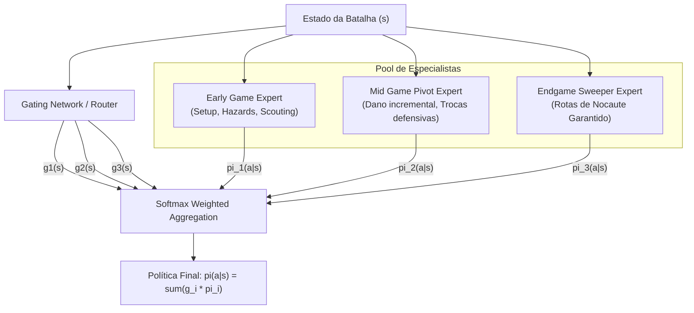

# Fusão e Composição de Modelos (Model Merging & Checkpoint Blending)

Este documento estabelece as diretrizes de engenharia para **combinar, interpolar e mergear pesos de redes neurais** treinadas em diferentes condições, hiperparâmetros, formatos e fases de batalha no Amnesia-AI.

---

## 1. Por que Merge de Modelos em Pokémon AI?

No treinamento de agentes de ponta, surgem múltiplos modelos especializados:
- Modelos treinados em **diferentes formatos** (`gen9randombattle` vs `gen9ou`).
- Modelos focados em **fases de jogo distintas**:
  - *Early Game Specialist*: Focado em posicionamento de hazards, screens, scouting de itens e preservação de momentum.
  - *Endgame Cleaner*: Focado em rotas de nocaute garantido, sacrifícios táticos e eliminação de ameaças residuais.
- Modelos treinados com **diferentes objetivos** (BC puro em replays de humanos vs Self-Play RL via PPO no simulador).
- **Checkpoints temporais**: Redes treinadas em diferentes sementes aleatórias (*random seeds*) ou épocas de treinamento.

Em vez de descartar checkpoints intermediários ou arcar com o custo de latência de rodar múltiplos modelos em tempo real, **Model Merging** combina os pesos diretamente no espaço de parâmetros $\Theta$, criando um modelo único sem sobrecarga de inferência.

---

## 2. Métodos de Fusão de Parâmetros

Sejam dois ou mais modelos que compartilham a mesma topologia de rede: $\theta_A, \theta_B \in \mathbb{R}^D$, e opcionalmente um modelo base $\theta_0$.

### 2.1 Linear Weight Averaging (Polyak / EMA)

A forma mais simples e robusta de fusão linear:

$$\theta_{\text{merged}} = \alpha \theta_A + (1 - \alpha) \theta_B, \quad \alpha \in [0, 1]$$

- **Aplicação no Amnesia-AI**:
  - **Exponential Moving Average (EMA)** durante o treino de BC para suavizar oscilações de gradiente.
  - Combinação de checkpoints da mesma corrida de treino (ex.: média das 5 melhores épocas de validação — *Checkpoint Averaging*).

### 2.2 SLERP (Spherical Linear Interpolation)

Redes neurais operam em espaços de alta dimensão onde a distância angular preserva características geométricas muito melhor que a interpolação euclidiana direta.

$$\Omega = \arccos\left(\frac{\theta_A \cdot \theta_B}{\|\theta_A\| \|\theta_B\|}\right)$$

$$\theta_{\text{SLERP}}(t) = \frac{\sin((1 - t)\Omega)}{\sin \Omega} \theta_A + \frac{\sin(t\Omega)}{\sin \Omega} \theta_B, \quad t \in [0, 1]$$

- **Vantagem**: Evita a degradação da magnitude e norma dos pesos que costuma ocorrer na média linear simples, preservando a calibração de probabilidades de saída (logits).
- **Aplicação**: Fusão entre modelo de **Behavioral Cloning (BC)** e modelo de **Reinforcement Learning (RL)**.

### 2.3 Task Arithmetic (Vetores de Tarefa)

Definimos um vetor de tarefa $\tau_i$ como a diferença entre um modelo ajustado para a tarefa $i$ e o modelo base $\theta_0$:

$$\tau_i = \theta_i - \theta_0$$

Podemos compor capacidades analíticas adicionando e subtraindo vetores com coeficientes de escala $\lambda_i$:

$$\theta_{\text{merged}} = \theta_0 + \sum_{i} \lambda_i \tau_i$$

- **Exemplo Prático**:
  - $\theta_0$: Modelo pré-treinado genérico em todos os formatos.
  - $\tau_{\text{OU}}$: Especialização em mecânicas de OverUsed (hazard stack, Tera timing).
  - $\tau_{\text{Aggro}}$: Especialização em playstyle hiperofensivo.
  - $\theta_{\text{Merged}} = \theta_0 + 0.6 \tau_{\text{OU}} + 0.4 \tau_{\text{Aggro}}$.

### 2.4 TIES-Merging (Trimming, Electing Sign, and Merging)

Quando múltiplos especialistas são fundidos, coordenadas com sinais opostos podem se anular mutuamente (*interference destruction*). O TIES resolve isso em 3 passos:
1. **Trim**: Mantém apenas as $k\%$ maiores mudanças de peso em magnitude por parâmetro (eliminando ruído irrelevante).
2. **Elect Sign**: Vota no sinal majoritário ($\pm$) para cada parâmetro individual.
3. **Disjoint Merge**: Realiza a média apenas dos tensores cujos sinais concordam com o voto majoritário.

---

## 3. Arquitetura de Mistura Dinâmica (Inference Mixture of Experts - MoE)

Quando a fusão estática de pesos prejudica a especialização de formatos distintos, adotamos uma arquitetura de roteamento dinâmico em tempo de execução:



### Características do Router por Fase de Batalha:
- $g_1(s)$ recebe maior peso quando ambos os jogadores possuem $6$ Pokémon vivos e poucos hazards em campo.
- $g_3(s)$ assume controle quando um ou ambos os times possuem $\le 2$ Pokémon vivos.

---

## 4. Estratégia de Versionamento e Registro de Modelos

Para garantir total reprodutibilidade, todos os checkpoints e merges gerados são indexados no registro estruturado de modelos em JSON (`data/models/registry.json`).

### Formato do Metadado do Checkpoint:

```json
{
  "model_id": "amnesia-bc-slerp-v1.2",
  "base_architecture": "ResNet18-ShowdownDualHead",
  "merge_type": "slerp",
  "components": [
    {
      "checkpoint_path": "checkpoints/bc_elite_1800_epoch20.pt",
      "weight": 0.65,
      "role": "elite_human_prior"
    },
    {
      "checkpoint_path": "checkpoints/rl_selfplay_ppo_iter40.pt",
      "weight": 0.35,
      "role": "exploit_resilience"
    }
  ],
  "format": "gen9randombattle",
  "evaluation_metrics": {
    "winrate_vs_random_ai": 0.984,
    "winrate_vs_heuristic_bot": 0.812,
    "top1_action_agreement": 0.589
  },
  "created_at": "2026-10-07T14:00:00Z"
}
```

---

## 5. Implementação Prática: Script de Merge de Pesos

Um utilitário de linha de comando dedicado é fornecido para mesclar dois modelos PyTorch via SLERP ou Linear Averaging:

```bash
# Executar fusão via SLERP com razão 0.7 para o modelo A e 0.3 para o B
python projects/model-merger/merge.py \
  --model-a checkpoints/bc_elite.pt \
  --model-b checkpoints/rl_selfplay.pt \
  --method slerp \
  --alpha 0.7 \
  --output checkpoints/merged_amnesia_v1.pt
```
